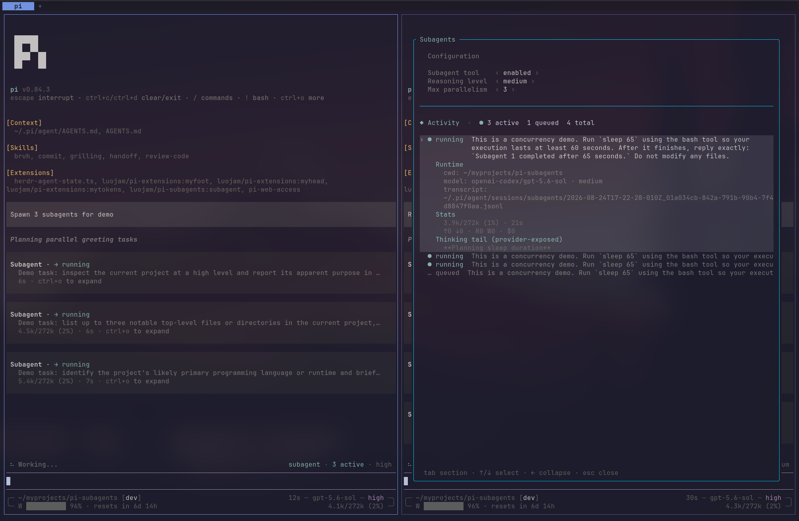
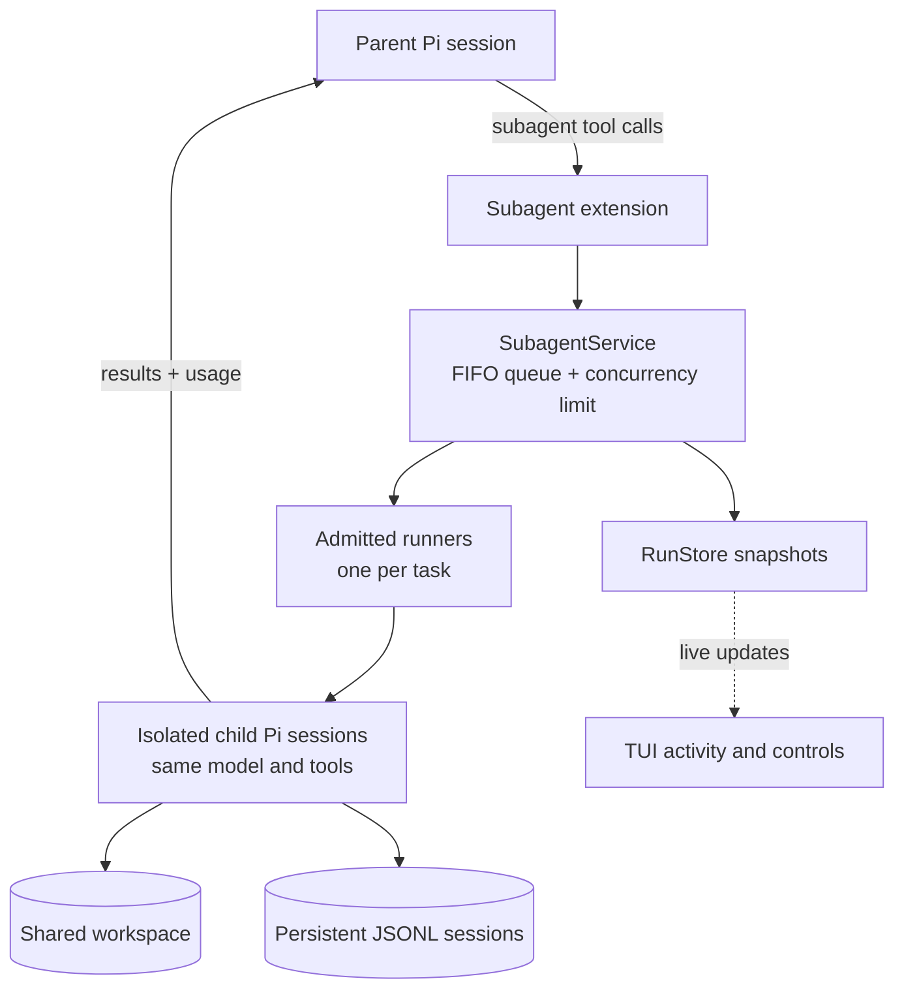

<div align="center">

# Pi Subagents

Configurable subagent extension for Pi.



</div>

## Features

- Enable or disable the subagent tool.
- Configure 1–8 parallel subagents (default: 3).
- Set the subagent reasoning level. By default, subagents inherit the parent’s reasoning level.
- Each subagent inherits the parent model, tools (excluding subagent), instructions, and project context.
- Inspect subagent runs from the TUI.
- Subagent transcripts are saved as JSONL under `<agent-dir>/sessions/subagents/` (default: `~/.pi/agent/sessions/subagents/`).

## Install

```bash
pi install git:github.com/luojam/pi-subagents
```

Or try it for one session:

```bash
pi -e git:github.com/luojam/pi-subagents
```

## Controls

| Action | Command / shortcut |
| --- | --- |
| Open activity and settings | `/subagents` or `Ctrl+Alt+S` |
| Cycle reasoning level | `Ctrl+Alt+R` |
| Set parallelism | `/subagents` → **Max parallelism** |
| Enable or disable delegation | `/subagents` → **Subagent tool** |

Reasoning inherits the parent by default. You can choose `low`, `medium`, `high`, `xhigh`, or `max`; Pi automatically clamps the choice to the selected model's capabilities.

## Local development

```bash
npm install
pi -e ./extensions/subagent/index.ts
```

## Architecture



## License

[MIT](./LICENSE)
