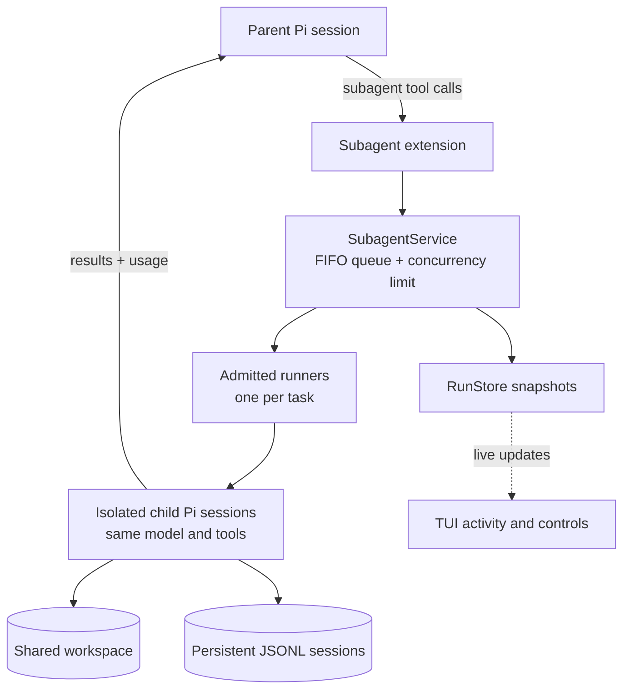

<div align="center">

# π Subagents

**Give Pi a small team.**

Delegate focused work to isolated child agents and run independent tasks in parallel—all without leaving your Pi session.

[](./package.json)
[](./LICENSE)

</div>

## Highlights

- ⚡ **Parallel by default** — run up to 3 agents at once, configurable from 1–8.
- 🧠 **Full Pi environment** — each child gets the parent model, tools, instructions, and project context.
- 👀 **Live activity** — follow queued and active runs from the TUI.
- 💾 **Persistent sessions** — child transcripts are saved as JSONL in Pi's agent session directory.
- 🛑 **Built-in control** — queueing, cancellation, and clean shutdown are handled for you.

> Subagents have isolated conversation contexts, but share the filesystem. They cannot spawn more subagents.

## Install

```bash
pi install git:github.com/luojam/pi-subagents
```

Or try it for one session:

```bash
pi -e git:github.com/luojam/pi-subagents
```

## Use

Just ask Pi to delegate suitable work:

> Use subagents in parallel to inspect the architecture, test coverage, and documentation, then combine their findings into a plan.

Each tool call handles one focused task. Independent calls emitted together run in parallel; dependent work should wait for the prerequisite results.

Subagents are especially useful for **research, codebase exploration, reviews, tests, and changes in separate modules**.

## Controls

| Action | Command / shortcut |
| --- | --- |
| Open activity and settings | `/subagents` or `Ctrl+Alt+S` |
| Cycle reasoning level | `Ctrl+Alt+R` |
| Set parallelism | `/subagents` → **Max parallelism** |
| Enable or disable delegation | `/subagents` → **Subagent tool** |

Reasoning inherits the parent by default. You can choose `low`, `medium`, `high`, `xhigh`, or `max`; Pi automatically clamps the choice to the selected model's capabilities.

## Parallel work safely

Run tasks together only when they do not write the same files or compete for shared resources such as Git state, package managers, tests, ports, or databases. Use parallel agents for independent work and serial agents for overlapping changes.

## Local development

```bash
npm install
npm test
npm run typecheck
pi -e ./extensions/subagent/index.ts
```

## License

[MIT](./LICENSE)

## Architecture


